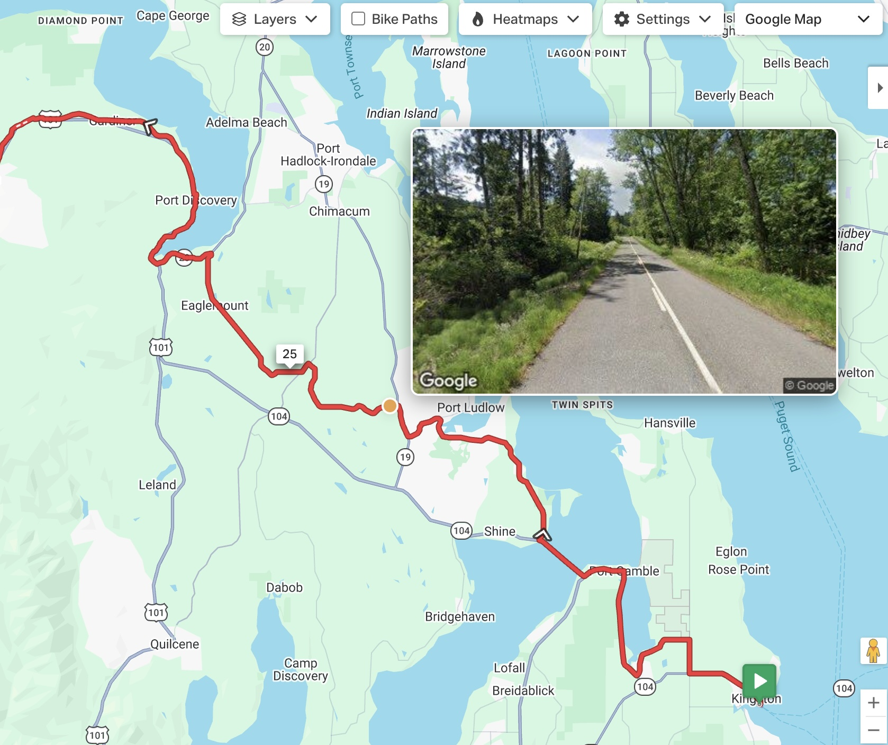

#  Street View Preview for RideWithGPS

Chrome extension that shows a Google Street View preview when hovering over a route in the [RideWithGPS](https://ridewithgps.com) route planner or route viewer.

Works when Google Maps is selected as the map type in the route editor.

## Install

* [Official release on Chrome Webstore](https://chromewebstore.google.com/detail/street-view-preview-for-r/hpfaghkgcedahbbhkiodlpcilngpbhdl)

Or install from source:

1. Clone or [download](https://github.com/nslussar/rwgps-streetview/archive/refs/heads/main.zip) this repository
2. Open `chrome://extensions` in Chrome
3. Enable **Developer mode** (top right toggle)
4. Click **Load unpacked** and select the repository folder
5. Click the extension icon and enter a Google Maps API key (see below)

## API Key Setup

You need a Google Maps API key with the **Street View Static API** enabled:

1. Go to [Google Cloud Console](https://console.cloud.google.com/apis)
2. Create a project (or select an existing one)
3. Enable the **Street View Static API**
4. Go to **Credentials** > **Create Credentials** > **API Key**
5. Recommended: restrict the key to **Street View Static API** only

The Street View Static API includes 10,000 free requests per month. See [Google Maps Platform pricing](https://developers.google.com/maps/billing-and-pricing/pricing#streetview-pricing) for current rates above the free tier.

## Usage

1. Open a route in the RideWithGPS route planner (works both in route preview & edit modes)
2. Select **Google Maps** as the map type
3. Hover near the route line -- a Street View preview appears showing the road ahead

## API Usage & Cap

The extension enforces a configurable monthly cap on Street View Static API requests (default **10,000**, Google's free tier). The popup shows the monthly total, cap, and cache hits (which don't count toward the cap or bill against your key).
