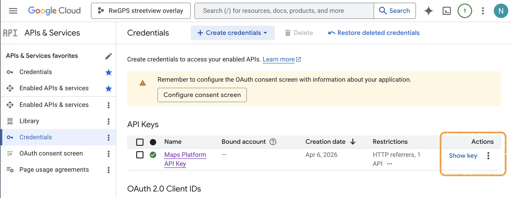
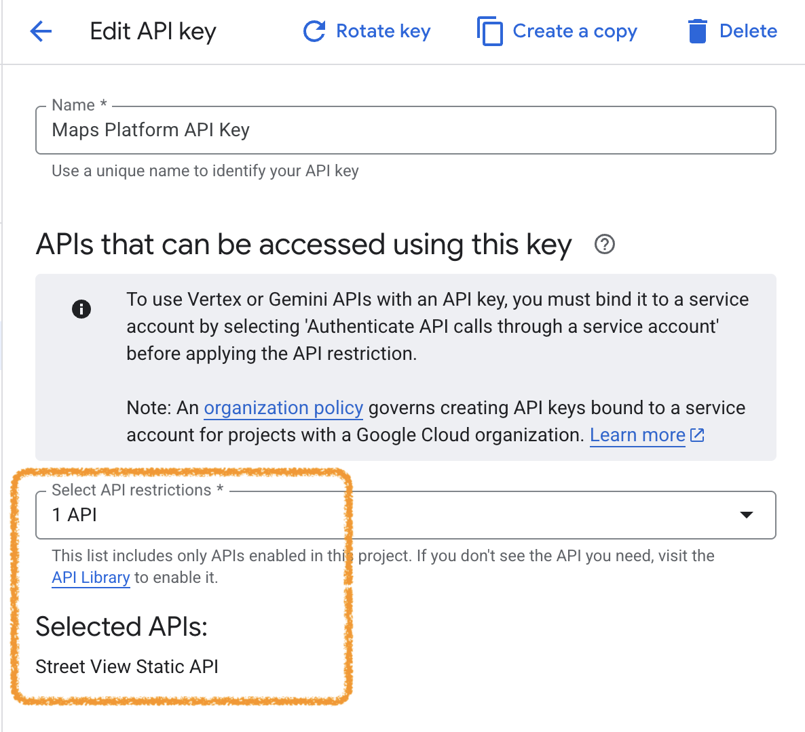
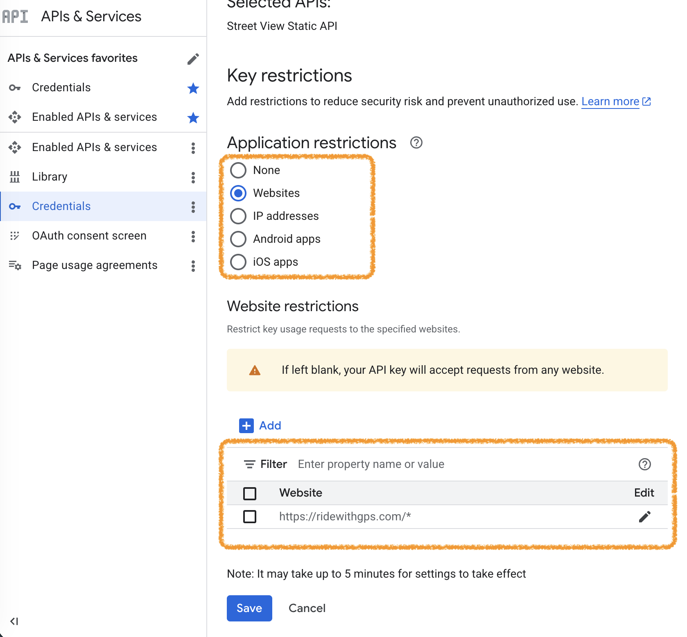
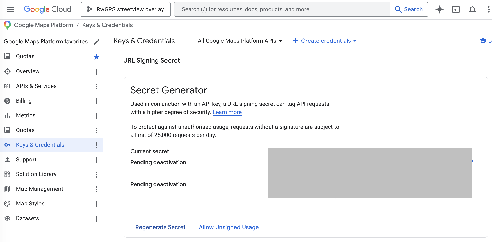
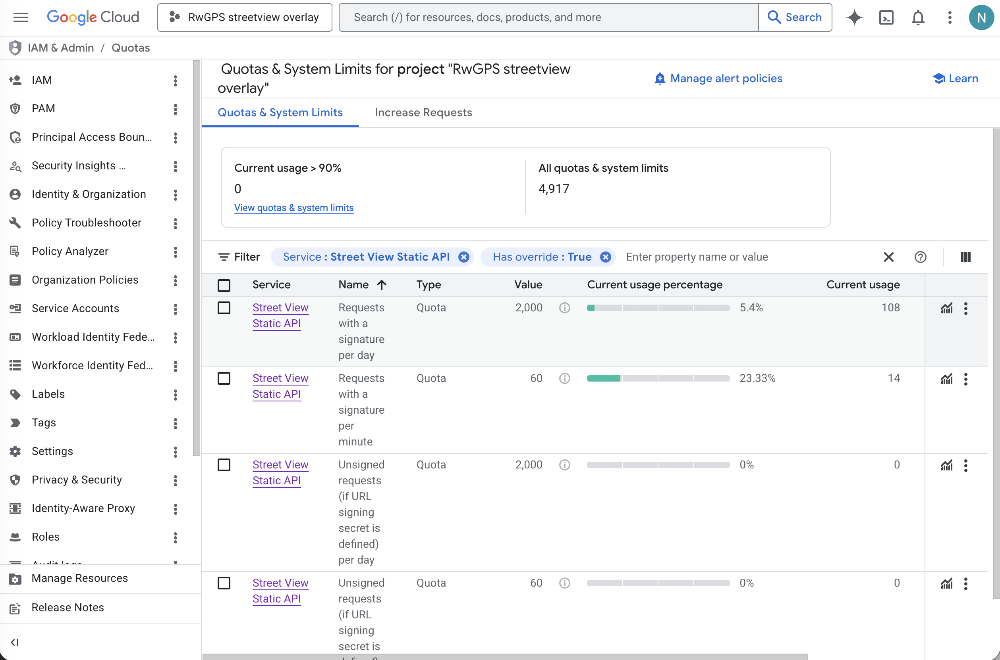
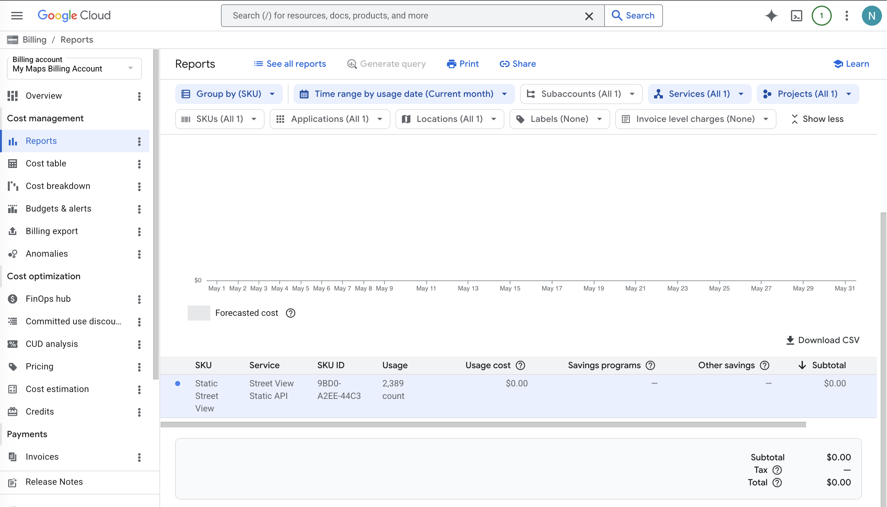

# API Key Setup

This walkthrough sets up a Google Maps API key with four independent safety layers. Bypassing any one of them does not bypass the others.

1. **API restriction** — the key can only call Street View Static.
2. **Referrer restriction** — requests are only accepted from `ridewithgps.com`.
3. **GCP daily quota** — Google enforces a per-day request ceiling.
4. **In-extension monthly cap** — the popup enforces a separate monthly limit.

## 1. Create a project and enable the API

1. Open the [Google Cloud Console](https://console.cloud.google.com/apis).
2. Create a new project or select an existing one.
3. Open **APIs & Services → Library**, search for **Street View Static API**, click **Enable**.
4. Billing must be enabled on the project (Google requires a credit card on file even for free-tier usage). The Street View Static API includes 10,000 free requests per month — see [pricing](https://developers.google.com/maps/billing-and-pricing/pricing#streetview-pricing) for rates above that.

## 2. Create the API key

1. Open **[APIs & Services → Credentials](https://console.cloud.google.com/apis/credentials)**.
2. Click **+ Create credentials → API key**.
3. Copy the generated key (starts with `AIza...`).



## 3. Restrict the key

From **[Credentials](https://console.cloud.google.com/apis/credentials)**, click the key name to edit it.

### 3.1 API restriction

Under **API restrictions** → **Restrict key**, choose **Street View Static API** only. Save.

This blocks abuse of unrelated APIs (Geocoding, Directions, Places), some of which cost several times more per request than Street View.



### 3.2 Referrer restriction

Under **Application restrictions** → **Websites**, add:

```
https://ridewithgps.com/*
```

Save.

Browsers populate the `Referer` header automatically based on page origin, and Google rejects requests from other origins. Server-side scripts can spoof `Referer`, so this is defense-in-depth — the quota cap below is what provides actual dollar protection.



## 4. Configure the daily quota cap

Google only exposes adjustable per-day quotas on Street View Static when a **URL signing secret** exists on the project. The extension does not actually sign requests; the secret just needs to exist so the conditional quotas activate.

### 4.1 Generate a URL signing secret

1. Open the Maps Platform credentials page (separate from the generic GCP credentials):
   <https://console.cloud.google.com/google/maps-apis/credentials>
2. Locate **URL signing secret**.
3. If no secret is shown, generate one. The value never matters.
4. **Do not click "Allow Unsigned Usage."** That removes the conditional quotas configured next, leaving Street View requests with no per-day cap.



### 4.2 Edit the quotas

Open **[APIs & Services → Quotas](<https://console.cloud.google.com/iam-admin/quotas?pageState=(%22allQuotasTable%22:(%22f%22:%22%255B%257B_22k_22_3A_22Service_22_2C_22t_22_3A10_2C_22v_22_3A_22_5C_22Street%2520View%2520Static%2520API_5C_22_22_2C_22s_22_3Atrue_2C_22i_22_3A_22serviceTitle_22%257D%255D%22))>)** (preselects the Street View Static filter), then edit:

- **Unsigned requests (if URL signing secret is defined) per day** — set to a sensible ceiling. `2000` is conservative for personal use. Worst-case monthly bill is bounded by `quota × per-request price × 30`.
- **Unsigned requests (if URL signing secret is defined) per minute** — default `10` is too low for hover-driven use. Set to `60`.

Quota changes propagate within a few minutes.



## 5. Paste the key into the extension

Click the extension icon, paste the key, and hover over a route on `ridewithgps.com`.

The popup also exposes a configurable monthly cap (default 10,000) — the fourth safety layer, independent of GCP.

## 6. Monitor usage and billing

Three GCP surfaces report usage, and they don't agree because they measure different things:

- **[APIs & Services → Dashboard](https://console.cloud.google.com/apis/dashboard)** — `Requests` counts every HTTP response (billable + non-billable). `Errors %` mixes billable 404s (NOT_FOUND) with non-billable 429s (quota-rejected) and 403s, so `Requests × (1 − Errors%)` is **not** the billable count. Use this for traffic shape, not dollars.
- **[APIs & Services → Quotas](<https://console.cloud.google.com/iam-admin/quotas?pageState=(%22allQuotasTable%22:(%22f%22:%22%255B%257B_22k_22_3A_22Service_22_2C_22t_22_3A10_2C_22v_22_3A_22_5C_22Street%2520View%2520Static%2520API_5C_22_22_2C_22s_22_3Atrue_2C_22i_22_3A_22serviceTitle_22%257D%255D%22))>)** — the `Current usage` column on each quota row is near-real-time. Best surface for confirming current quota state before Billing Reports catches up.
- **[Billing → Reports](https://console.cloud.google.com/billing/reports)** — authoritative billable count. Group by SKU; the row is `Static Street View` (SKU `9BD0-A2EE-44C3`). The `Usage` column is what Google charged for. Lags a few hours.

Expected ordering of the three counters: extension's `streetviewNetwork` ≤ Billing Reports `Usage` ≤ Dashboard `Requests`. The extension undercounts (one profile only, excludes cache hits); Billing is below Dashboard because non-billable errors inflate the Dashboard total. A big gap between the extension and Billing usually means another profile/device is using the same key.

The per-day quota set in §4.2 is the real dollar ceiling: it counts every unsigned request, billable or not, and rejections after exhaustion are non-billable — so the worst-case daily billable count cannot exceed the quota. The in-extension monthly cap only protects against the extension's own runaway behavior, not a leaked key.



---

## Troubleshooting

The popup surfaces invalid-key, monthly-cap, and rate-limit states.

**`g.co/streetviewerror/signature` in the overlay** — per-day or per-minute unsigned quota is exhausted. Check **[APIs & Services → Quotas](<https://console.cloud.google.com/iam-admin/quotas?pageState=(%22allQuotasTable%22:(%22f%22:%22%255B%257B_22k_22_3A_22Service_22_2C_22t_22_3A10_2C_22v_22_3A_22_5C_22Street%2520View%2520Static%2520API_5C_22_22_2C_22s_22_3Atrue_2C_22i_22_3A_22serviceTitle_22%257D%255D%22))>)**. Quotas reset daily.

**Unexpected billing** — the per-day cap only applies to rows whose name includes "if URL signing secret is defined", and only while a signing secret exists.

**Logs** — page console on a `ridewithgps.com` tab is prefixed `[RWGPS Street View]`. Service worker console (`chrome://extensions` → *Street View Preview* → **Service worker**) is prefixed `[RWGPS SV bg]`.
